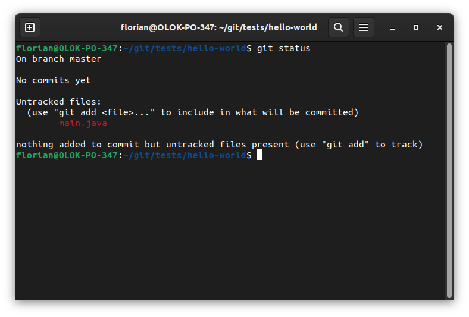
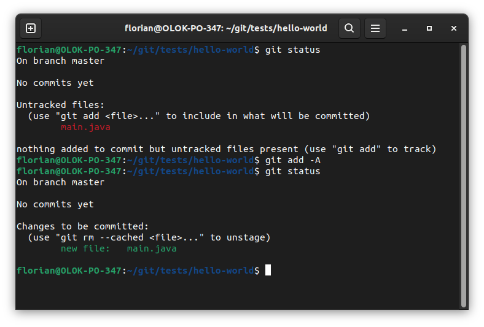
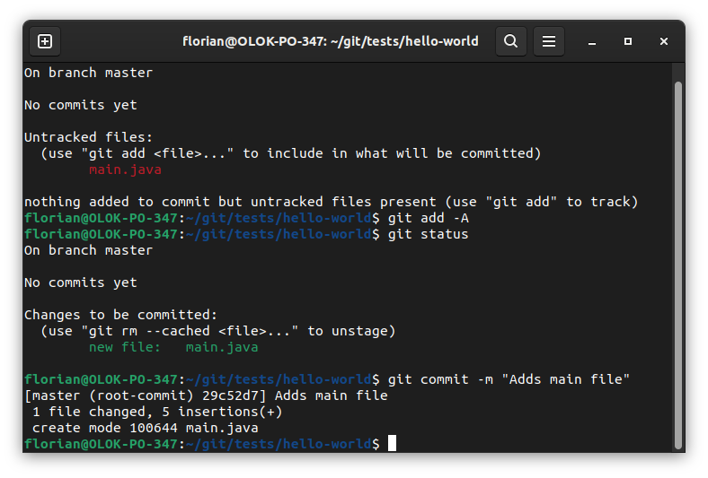

# How to git

This document explains how to use git. It is written in a way to be walked through from beginning to end.

Whenever you are supposed to do something it will be formatted like this:

> Open your terminal

When advised to enter somthing in you terminal this will be a code block with a `$` as prefix for each line to enter. The `$` must not be copied into the terminal.

```
$ ssh-keygen -t ed25519 -C "<comment>"
```

Optional notes that are somewhat relevant are formatted as code blocks which a `Note:` headline.

```
Note:
This is a note.
```

Let's get started.

## Installation

git is available for all platforms. You can find the installation description here:

https://git-scm.com/book/en/v2/Getting-Started-Installing-Git

> Install git

## Git via terminal

Git can be used via terminal or via several UI clients. To understand git properly we will start with using it via terminal and later switch to a UI client.

**For Windows users**: When installing git you also get a git terminal wich includes a basic linux environment. Linux is useful to do software development. But you can use powershell or cmd as well.

> Open your terminal


### Authentication

To access a hosted repository we need to authenticate. You can generate a ssh key to authenticate for interacting with a hosted git repository or use https. Using ssh is the recommended way since you don't need to enter your credentials every time you interact with the repository.

You can generate an ssh key lssh-keygen -t ed25519 -C "<comment>"ike this:

```
$ ssh-keygen -t ed25519 -C "<comment>"
```

Use `<comment>` to describe the use of this key for yourself. So you don't need to remember why you have this key.

When asked for a file path, don't use the default but change the file name to something you can make sense of:

**Example:**


> Execute the command above in your terminal

If you use https git will ask you for your credentials.

Now you can upload **gitlab-work.pub** to your git hosting service. Make sure to get the (.pub) public key **not the private key** (no file ending).

> Upload the ssh public key to your github account

### clone a repository

With git we want work on one repository with multiple people. To do so we fetch a clone of this repository to our local machine.

> Receive access to the tutorial repo

Now you can get your local clone. Where you place this is up to you. But as a general suggestions:

- Don't nest too deeply
- Put everything in one place

I always clone everything in `/home/<my-username>/git`. The Windows equivalent would be `C:\Windows\Users\<my-username>\git`.

```
Note:
git repositories may come from different places but in general they have one feature that other files in on your system probably don't have: They are only local copies. You are advised to never keep local changes locally for a long time. In other words: Deleting the whole git folder must never be a big problem. Worst case: You loose a days work.
```

> Navigate to your local workspace

> clone the repository via ssh as shown on the project page: https://github.com/openknowledge/git-tutorial/tree/main

```
$ git clone git@github.com:openknowledge/git-tutorial.git
```

> Navigate into your freshly created repository


The result should be a mostly empty folder with the following structure:

```
- git-tutorial <- Our repo folder
  - README.md  <- The only file in this repo at this moment
  - .git/      <- Internal folder of git. This is required
                  from git and must not be changed or deleted
```

### git workflow

With git we want to perform parallel work on the same files. This will lead to conflicts at some point. To deal with this git gives us several tools:

1. Local clone of the repo
2. Commits
3. Branches and Tags
4. Rebasing/Merging
5. Amend
6. Reset

**Local clone of the Repo**

We clone a repository locally and work only with this local clone.
A clone is a complete copy of the remote repository.
When we do changes in our local clone (e.g. editing a file) and we think we have finished something, we will want to commit this change.

**Commits**

A commit is a set of changes in your repository. It consists of

- 0 to 2 parents
- Author
- Timestamp
- Commit message
- Commit hash

A commit is immutable. It will never change. You can replace a commit with a new one though. They are also globally unique. A commit in your repository will never have the same id in any other repo in this world. Commits that are pushed are not easily deleted.

```
Note:
A commit is not a revision but a set of change that the repo from state 1 to state 2.
```

> Create the file "main.java" and add the following text to it.
>
> ```
> public class HelloWorld {
>   public static void main(String[] args) {
>     System.out.println("Hello, world!");
>   }
> }
> ```

Now we have a changed file. Git know about this changed file. You can inspect the current repo status via

```
$ git status
```



You can see the `main.java` is marked as "untracked files". And that you can add it to the set of files you want to create a commit with by using `git add <file>`.

We can add the single file via

```
$ git add main.java
```

or we add all files via.

```
$ git add -A
```

When you run `git status` now you can see which files would be committed now. Note: We haven't committed yet. We just marked files to be included in a commit, if we were to commit now. Which we will do.



> Create a commit by running the command below

```
$ git commit -m "Adds main file"
```



We created a new commit. Our commit changes was file and has the commit message "Adds main file". Commit messages should adhere a certain structure:

```
<short messsage in present tence without final dot>

<optional: Longer explanation. Maybe multiple sentences or bullet list.>
```

<!-- In addition it very handy to use some fixed definition of how to write commits. It's not required but I highly recommend to use https://www.conventionalcommits.org/en/v1.0.0/. -->

Let's get back to our commit: Check the repository (in gitlab) where you cloned from. You will see that your commit is **not** there yet. Thats expected because creating a commit in git does not upload the commit. The reason is that we might work on a complex thing that requires several steps and we want to create separate commits for each step.

```
Note:
Some rules of thumb for commits:
- A commit must always be a valid increment.
- If you can not find a good short message for your commit it might not be finished or too large.
```

Our commit should be added to the remote repository. We can achieve that by executing

```
$ git push
```

But what happens when multiple people try to push the same or overlapping changes? To deal with this situation we use branches and rebasing. The next two chapters will deal with these topics.

**Branches and Tags**

Branches are just labels on commits. A git repo basically only knows commits and when you create a branch you just write that down on the commit.

There are other labels on commits called "tags". They are used to mark fixed versions of a software. E.g. the tag "v1.0.0" will be used to show that a certain commit of a repo is considered the version 1.0.0 of this software.

Branches and tags do not change commits. You can delete branches and tags and you will not delete commits.

Branches are used to indicate a separate branch of work. People can create their own branches to work with and later merge them together.

Git has always one main branch called "main" or "master". This branch is used to keep the "current version" of the repository. You can use branches to come up with different ways of working with your repo. All in all you will want to:

1. Allow parallel work.
2. Get branches back into main to improve the software.

A valid approach to use branches could be to do the following.

- Main is always the latest released version
- When I want to add a new feature/ improve something/ fixe a bug I create a new branch called `feature/\<feature name\>` or `fix/\<ticket it\>`
- I work in my branch
- Whenever a brach is "finished" it is merged into main

Lets each create a branch with a very simple feature. Our main shall just print some different message than hello world. e.g. `feature/print-hello-java`

You can create a branch with `git checkout -b`. If you have an existing branch you want to use you can do that via `git checkout branchname`.

Checkout the git documentation via

```
$ git --help
$ git checkout --help
```

> Create a branch called "feature/\<your feature name\>

```
$ git checkout -b "feature/print-hello-java"
```

We now switched our branch to a newly created one. This branch points to the commmit we created earlier. We can upload this brach by pushing it to our remote repository:

```
git push -u origin <branch>
```

This means "git push to origin the branch <\branch\>. We won't go into what exactly origin means here. You can read into that by reading the git book. For now: Origin means where our repo came from. That means in our case the remote repository in github.

> Check the uploaded branch in gitlab

We can now merge one branch into main and see what happens with all parallel branches.

**Rebasing/Merging**

Whenever we have a diverging histories that we want to combine we can do that by rebasing one on the other. In our case we have a branch with the history

branch:

```
52234 --> 9323
```

and a main branch with the history

main:

```
52234 --> 25234
```

Each number indicates a commit.

What we want to achieve is to make our branch look like it was built on top of the current state of main:

branch:

```
52234 --> 25234 --> 9323
```

We can do this via rebasing.

Lets check out how rebasing works => `git-rebase.pdf`

> Switch to main branch

> Pull changes from remote

> Go back to your branch via

```
$ git checkout -
```

> Rebase on main via

```
$ git rebase main
```

### Interlude: Interactive rebase

Sometimes rebasing is hard because many changes happend on your remote branch. In these cases you can apply every commit of a rebase part by part and deal with merge conflicts manually. This is done via

```
git rebase -i <branch name>
```

> Force update your remote branch via

```
$ git push --force-with-lease
```

Force push will rewrite the history. This means you can loose commits. Use carefully.
Often force push is disabled on certain branches (like `main`). This can be configured in gitlab.

Check the mergability in github/gitlab

### Merging

Merging is like rebasing but keeping the separate branches alive and creating an "extra commit" called merge commit.

The most simple merge is the "fast forward merge". This case occurs when no merge commit is necessary. Thus it feels like.

## Amend

At some point you will forget to do something you wanted to do but you already created a commit. In this case you can "change" your commit (or replace it with another one). You can do so by using

```
git commit --amend
```

which will change **the latest** commit according to your needs. There are many more options for amending which you need to read about when it comes to this. When you want to change commits older than the latest one, you need to do an interactive rebase and amend the commit of your interest.

## Reset

You can reset you local changes at any time via. You will lose all your local changes.

```
git reset --hard
```

## git vs. svn

There are some relevant information for people coming from SVN to git:

- Commit often and small: You can change a local git history at any time and commits don't need to be fix forever.
- Offline capable: Since your clone is a **clone** you can work and commit without access to the remote repo.
- Solving conflicts: You can resolve conflicts without fear. If you do a mistake you can throw away everything and start again.
- There is a git-SVN bridge.
- You only need to push stuff that's needed.

## git via UI client

Modern IDEs include git tools that improve the common use cases of git a lot.

VS Code: Install the extension "GitLens".

IntelliJ: There are good tools per default.

## .gitignore and .git/info/exclude

We often have files in our project directory that should not be tracked (e.g. a built `.jar` file). You can state these files in .gitignore (which is checked in) and in `.git/info/exclude` which is local only. We don't want to commit binaries.

## Recap

- git works with local clones of the remote repository
- You can work locally without affecting others
- Changed files need to be staged to be added into a commit
- A commit is set of changes of the repository
- Commits can be pushed (uploaded) to a remote branch
- Commits are immutable
- The remote history can be rewritten if we made mistakes (creates new commits)
- Multiple commits can be rebased on a newer state to have a consistent history
- Local branches should be rebased on the main branch before merging into main
- You need to adjust git/gitlab to your needs. You need to find out what you need and configure/use the tools accordingly.

Checkout the cheat-sheet
