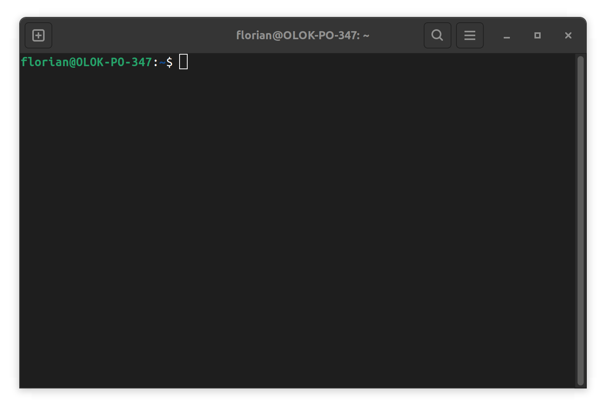
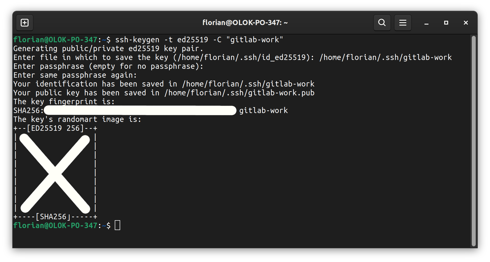
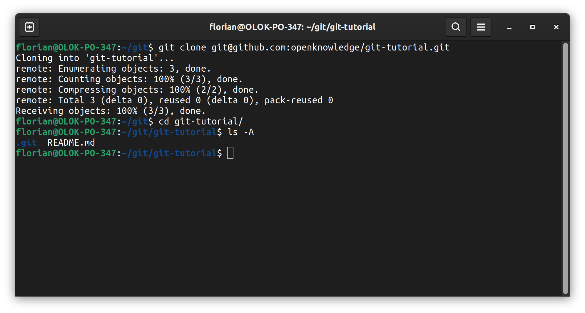

# How to git

This document explains how to use git. It is written in a way to be walked through from beginning to end.

Whenever you are supposed to do something it will be formatted like this:

> Open your terminal

When advised to enter somthing in you terminal this will be a code block with a `$` as prefix for each line to enter. The `$` must not be copied into the terminal.

```
$ ssh-keygen -t ed25519 -C "<comment>"
```

Optional notes that are somewhat relevant are formatted as code blocks which a `Note:` headline.

```
Note:
This is a note.
```

Let's get started.

## Installation

git is available for all platforms. You can find the installation description here:

https://git-scm.com/book/en/v2/Getting-Started-Installing-Git

> Install git

## Git via terminal

Git can be used via terminal or via several UI clients. To understand git properly we will start with using it via terminal and later switch to a UI client.

**For Windows users**: When installing git you also get a git terminal wich includes a basic linux environment. Linux is useful to do software development. But you can use powershell or cmd as well.

> Open your terminal



### Authentication

To access a hosted repository we need to authenticate. You can generate a ssh key to authenticate for interacting with a hosted git repository or use https. Using ssh is the recommended way since you don't need to enter your credentials every time you interact with the repository.

**TODO:** We need a repo. Either we create a new one in customers infrastructure or we use a public one in our github.

You can generate an ssh key lssh-keygen -t ed25519 -C "<comment>"ike this:


```
$ ssh-keygen -t ed25519 -C "<comment>"
```


Use `<comment>` to describe the use of this key for yourself. So you don't need to remember why you have this key.

When asked for a file path, don't use the default but change the file name to something you can make sense of:

**Example:**



> Execute the command above in your terminal

If you use https git will ask you for your credentials.


Now you can upload **gitlab-work.pub** to your git hosting service. Make sure to get the (.pub) public key **not the private key** (no file ending). 

> Upload the ssh public key to your github account

### clone a repository

With git we want work on one repository with multiple people. To do so we fetch a copy of this repository to our local machine.

> Receive access to the tutorial repo

Now you can get your local copy of the repo. Where you place this is up to you. But as a general suggestions: 
- Don't nest too deeply
- Put everything in one place

I always clone everything in `/home/<my-username>/git`. The Windows equivalent would be `C:\Windows\Users\<my-username>\git`.

```
Note:
git repositories may come from different places but in general they have one feature that other files in on your system probably don't have: They are only local copies. You are advised to **never** keep local changes locally for a long time. In other words: Deleting the whole git folder **must never** be a big problem. Worst case: You loose a days work.
```

> Navigate to your local workspace

> clone the repository via ssh as shown on the project page: https://github.com/openknowledge/git-tutorial/tree/main

```
$ git clone git@github.com:openknowledge/git-tutorial.git
```

> Navigate into your freshly created repository



The result should be a mostly empty folder with the following structure:

```
- git-tutorial <- Our repo folder
  - README.md  <- The only file in this repo at this moment
  - .git/      <- Internal folder of git. This is required
                  from git and must not be changed or deleted
```

### git workflow

With git we want to perform parallel work on the same files. This will at some point lead to conflicts. To avoid this git gives us several tools:

1. Commits
2. Local copy of the repo
3. Branches
4. Rebasing

**Commits**

TODO: 
- Explain what a commit is
- Create a commit
- Realize that a commit is not automatically pushed -> Next section


**Local copy of the Repo**
TODO:

- Explain why we have a local copy
- Explain that we can push one or more commits to a remote branch -> Next section

**Branches**

TODO:
- Explain what branches are and how we use them with a common dev processes
- There is a default branch: `main`
- Explain that branches need to be merged together into main which can lead to conflicts -> Next Section
- Let people create different branches
- Let people create several commits in these branches
- Make sure there are conflicts in the commits
- Investigate the repo state in github/gitlab

**Rebasing**
TODO:

- merge the first branch to main (via gitlab/github merge request)
- merge the second branch to main -> which leads to a conflict
- resolve this conflict locally via rebase in terminal
- push force-with-lease

Check the mergability in github/gitlab

## git via UI client

TODO: Show how to do git via VS Code

