# How to gitlab

Gitlab is a platform for hosting and processing code. 

With procesing I mean it solves some requirements we have in software development: 
- Distributing, creating and maintaining code in a team
- Build artifacts (Continous Integration)”
- Distributing the stuff we build code into (libraries, binaries, images, etc.) (Continuous Deployment)
- Organize team work (ticketing system, milestones, project plans)
- Organize documentation (wiki)
- Monitoring code, bugs and security problems
- Get insights into possible improvements via analytics

You can find these aspects in gitlabs sidebar:

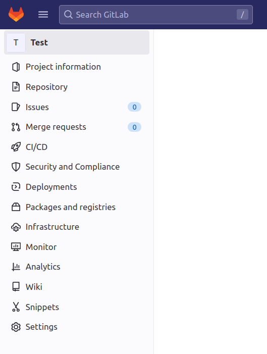

Usually we don't need everything at the start. This tutorial focusses on getting started with using gitlab. Not adminstering it.

## Users and groups

Gitlab has users and groups. Users can be part of multiple groups.

## Projects

Every user or group can have multiple projects. A project is a bucket that contains
- A git repo
- Issue system
- A wiki
- Packages
- and more

The overview for projects looks like this:

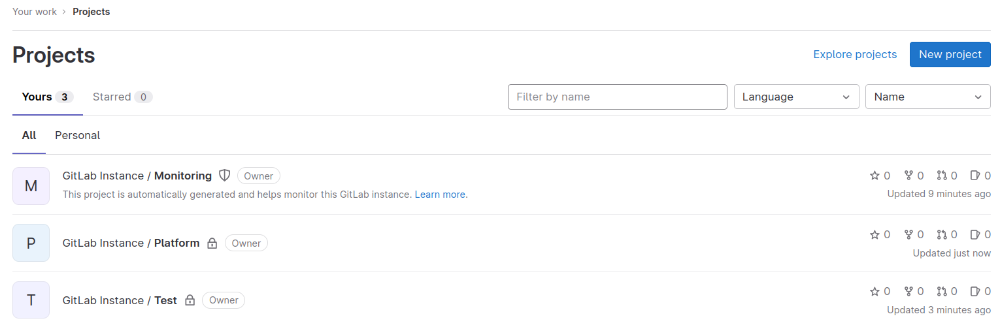

## The git in gitlab

First of all gitlab is a service for hosting git repositories. Therefore we have some basic tools to work with our remote repository.

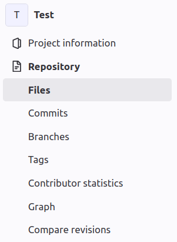

- Files: Browse the file tree
- Commits: An overview of all commits in this repository
- Branches: A table of your current branches
- Tags: The list of tags

Let's check our branches:

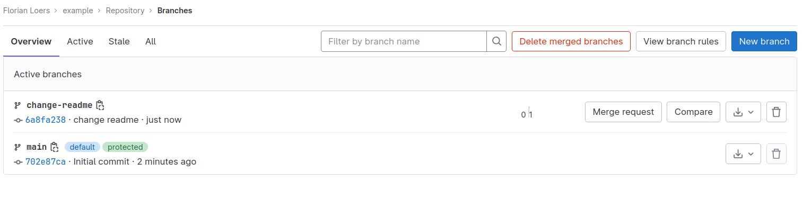

We have a main branch and a branch that is named `changed-readme`. This branch contains a change in the README.md file. You can see that the `change-readme` branch is 0 commits behind and 1 commit ahead of main.

Let's assume we want to merge this branch into main.


## Merge Requests

A very important part of gitlab are merge requests (at least for developers). Whenever you want to get changes from one branch into another (most of the time back to `main`) you will want to create a merge request.

Let's create a merge request for the `change-readme` branch.


Navigate to `Merge Requests`. We see an empty list. Also there is a notification of the latest push to `change-readme`. We can create a merge request here.
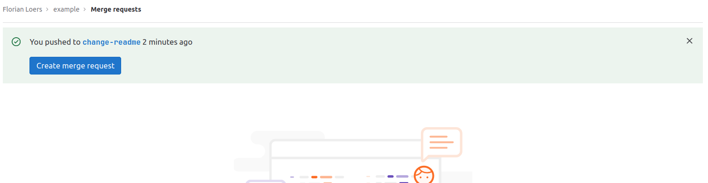

The merge request creation form is pre-filled. Depending on your process you will want to describe this merge request here, answering the questions: What will this change and why?

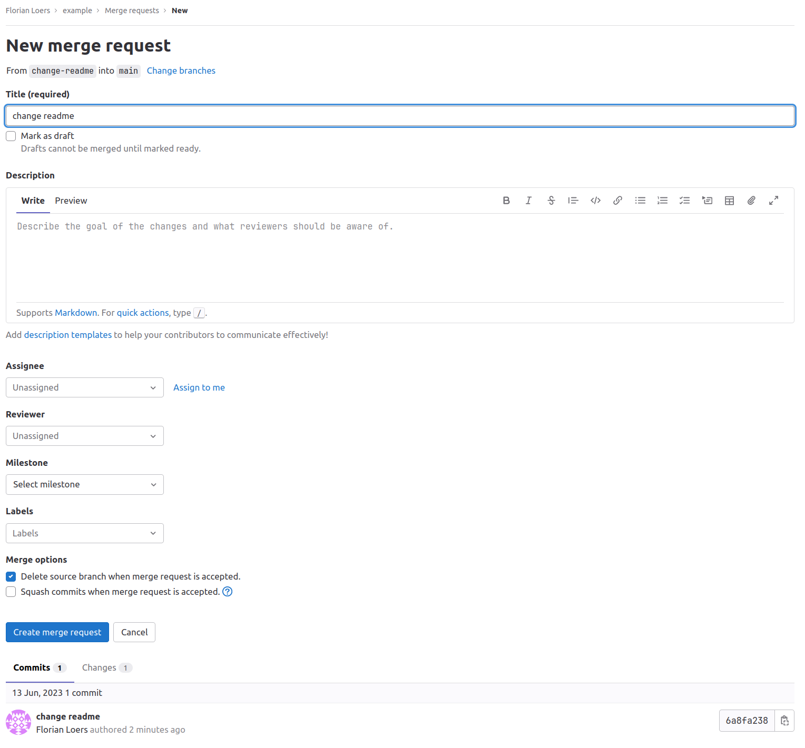

Let's just accept this for now. The resulting merge request page looks like this:

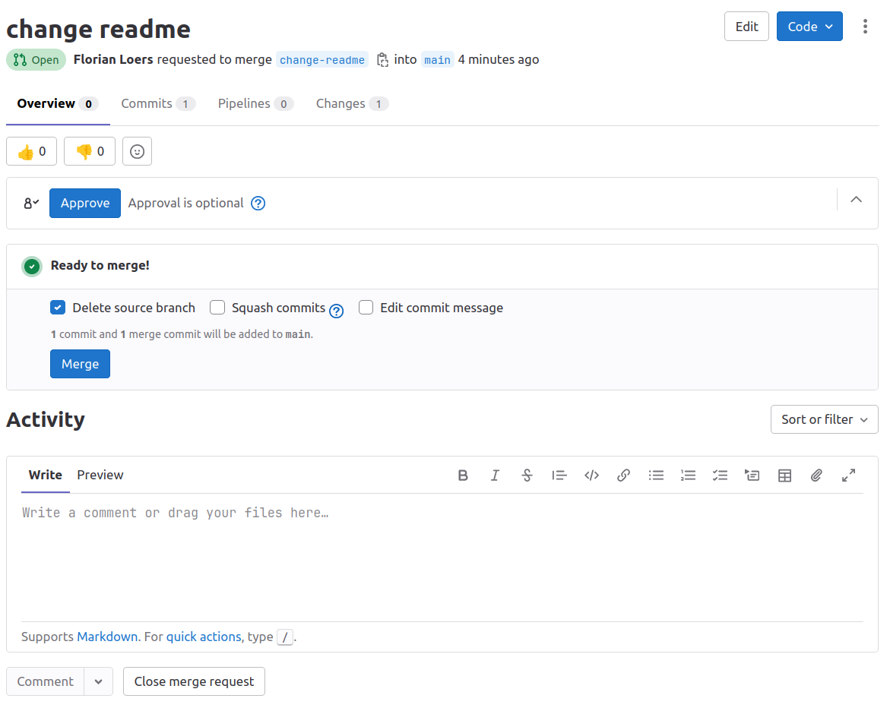

We can see who created the merge request, how many commits are part of it, which CI pipelines ran and how many changes were made.

We will have a look at CI/CD later. Let's check the changes:

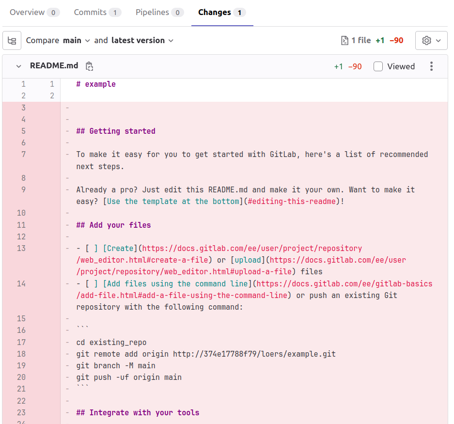

In the changes view we can see the changes made to the code in a diff view. This is the place to review our code, both our own code and the merge requests of others. In this case we can see that the content of the readme was mostly deleted.

We can merge this PR and the commits will be added to the main branch.


## Ticket System

Usually when we change code we have a reason to do so. Often these reasons are described in a ticketing system because working in the same code base with many people requires coordination.

Gitlab provides its own ticket system:

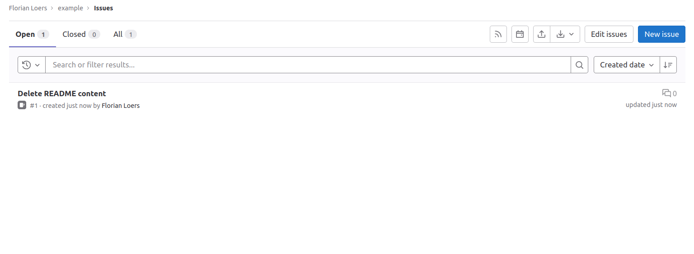

Currently, we have one ticket. It states that we have to delete the content of the README.md. That's fortunate because that's what we just did.

Tickets can also be viewed in a kanban board:

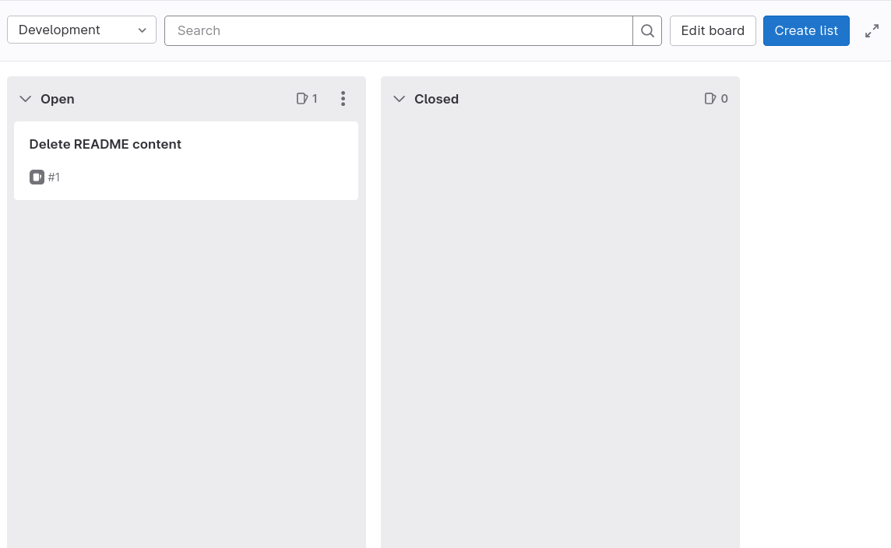

The default board has just two columns: Open and Closed. We can create more by adding labels (via `Project Information/Labels/New Label`) and then select the "Create list" button.

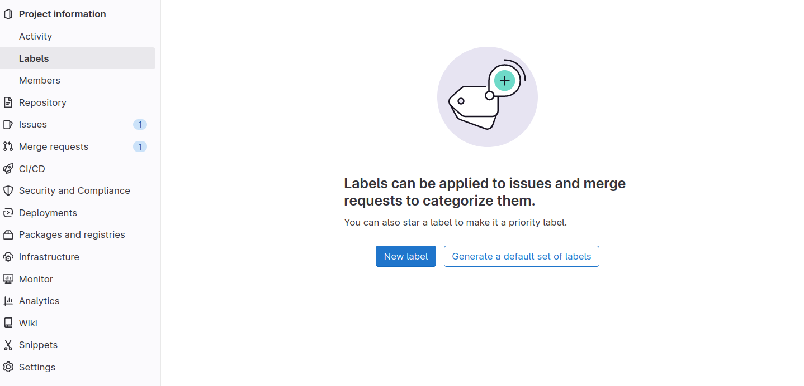

I will create the label "Development" and create a new column for this label in our board. The result looks like this:

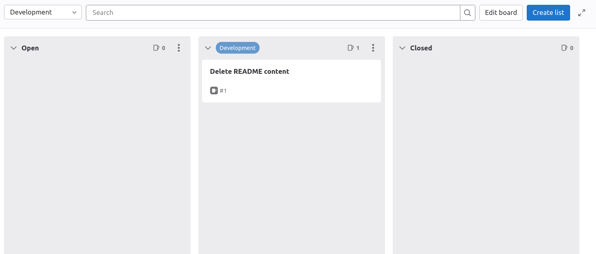

This way we can manage working in a team on the same code. We can create multiple boards, different types of tickets (Stories, Epics, Bugs, Tasks) by defining labels for them. We can define milestones and do all kinds of project planning.

## CI/CD

Usually when we change code we want others to review our changes. We can do that via merge requests as seen above. Another imporant part of quality assurance is running automated tests and checks. This can be done via gitlabs CI/CD features.

You can learn about it via gitlabs own documentation here: https://docs.gitlab.com/ee/ci/

In a nutshell:

You need to create a file called `.gitlab-ci.yml` in you project root. This file describes what you want gitlab to do and when you want it to do it. An example is:

```
image: maven:3-openjdk-8 # <-- The docker image to use

stages:
  - build
  - tests

Compile:
  stage: build
  script: mvn compile

Test:
  stage: tests
  script: mvn verify

Lint:
  stage: tests
  script: echo "call some external tools?"
```

This script will run on any commit and defines two stages: build and test. Stages are ordered.

The result will be visible in gitlabs CI/CD section:

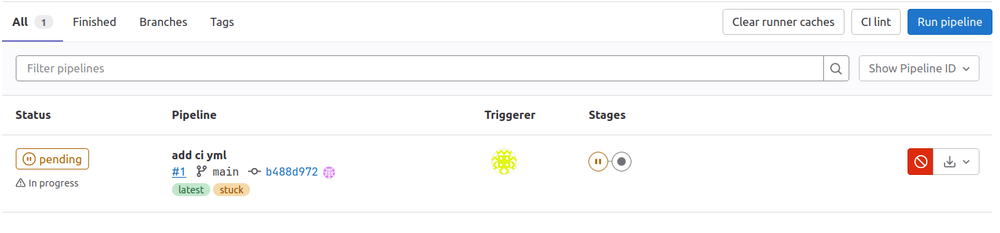

You can see the commit that added this script immediatly triggered the pipelines. Any other commit will trigger them too. When we select this pipeline we can see it's phases:

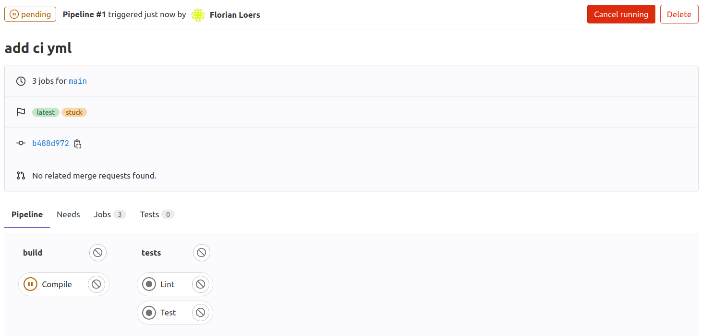


## Closing words

When you are familiar with github you will find that gitlab works very similar. If you are familiar with the Atlassian suite: Imagine gitlab is the combination of Bitbucket, Jira and Confluence.

If you are new to these tools you might want to dig deeper yourself. The gitlab documentation explains every aspect of gitlab: https://docs.gitlab.com/